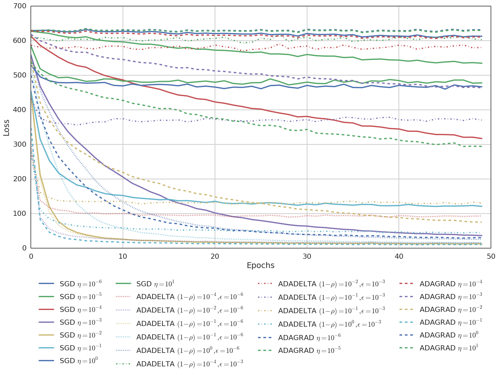
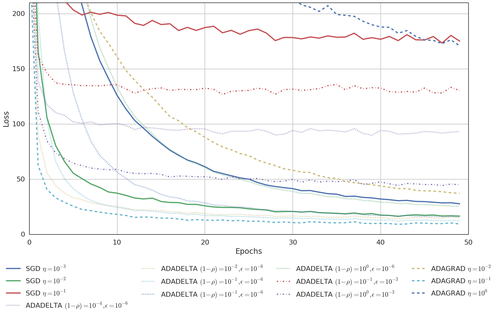
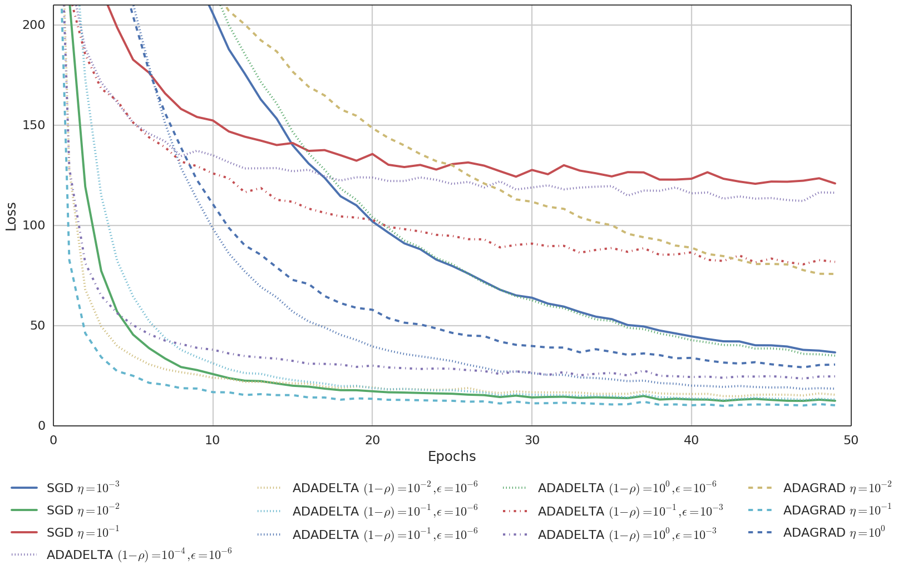

# Dividing vs. Not Dividing lrparam by nbatches

<!--
SGD, ADAGRAD, ADADELTA: in SGD and ADAGRAD, lrparam is NOT divided by the number of batches (100) at each iteration. In ADADELTA, the decay rate is fixed.

SGD, ADAGRAD, ADADELTA: in SGD and ADAGRAD, lrparam is divided by the number of batches (100) at each iteration. In ADADELTA, the decay rate is fixed.

-->

<!--
LOSS_THRESHOLD=200 SAVE_FILE=aifb_adadelta_rescaled_200.png ./show_losses.py ~/Copy/models_v2/v2/rescaled/aifb_*.pkl
LOSS_THRESHOLD=200 SAVE_FILE=aifb_adadelta_not_rescaled_200.png ./show_losses.py ~/Copy/models_v2/v2/not_rescaled/aifb_*.pkl
-->

SGD, ADAGRAD, ADADELTA: in SGD, ADAGRAD and ADADELTA, lrparam is NOT divided by the number of batches (100) at each iteration. ADADELTA makes use of the lrparam parameter according to [climin](http://climin.readthedocs.org/en/latest/adadelta.html).

SGD, ADAGRAD, ADADELTA: in SGD, ADAGRAD and ADADELTA, lrparam is divided by the number of batches (100) at each iteration. ADADELTA makes use of the lrparam parameter according to [climin](http://climin.readthedocs.org/en/latest/adadelta.html).

