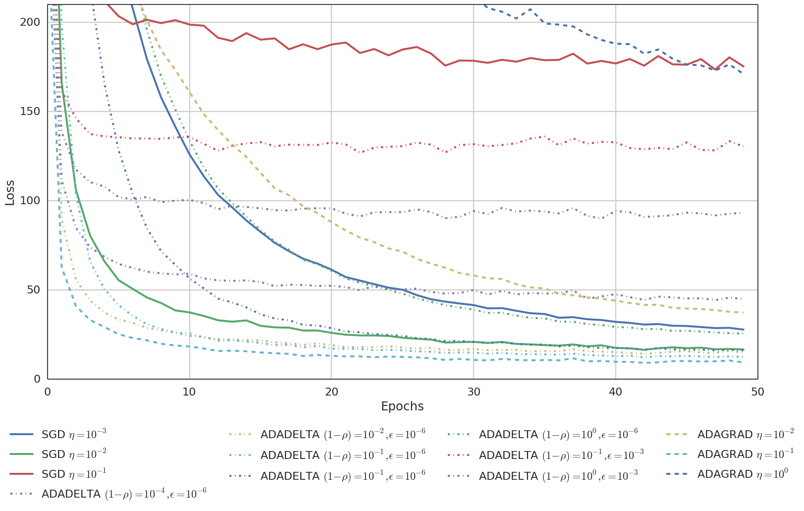
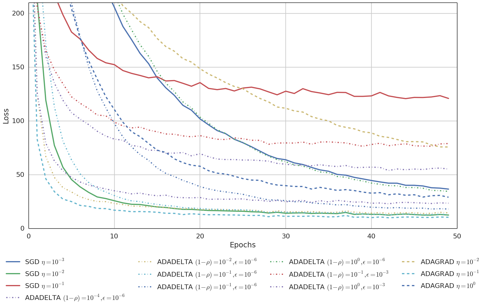
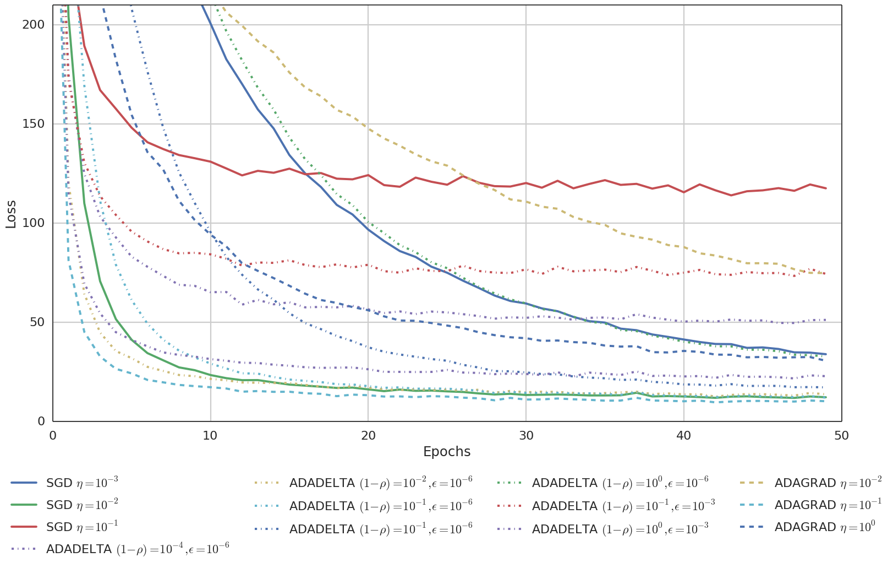

# Dividing vs. Not Dividing lrparam by nbatches

SGD, ADAGRAD, ADADELTA: in SGD, ADAGRAD and ADADELTA, lrparam is NOT divided by batchsize at each iteration.

SGD, ADAGRAD, ADADELTA: in SGD, ADAGRAD and ADADELTA, lrparam is divided by batchsize at each iteration.

SGD, ADAGRAD, ADADELTA: in SGD, ADAGRAD and ADADELTA, lrparam is divided by nbatches at each iteration.

